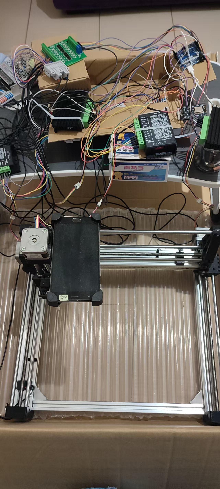
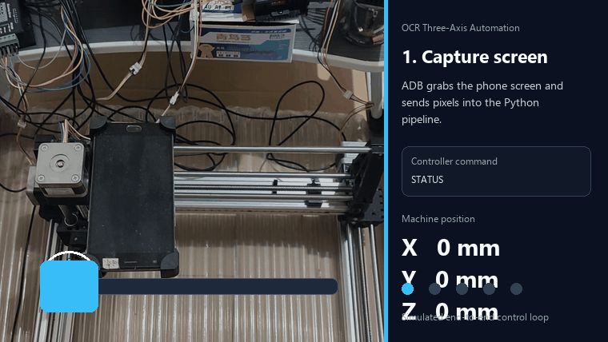
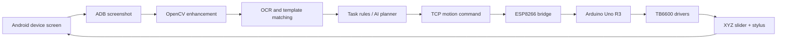

# OCR-Driven Three-Axis Automation Tool

Physical automation prototype for operating a phone-like device with a three-axis slider, OCR, AI planning, and a stylus end effector.





## Overview

This project explores a practical question:

> If a device has no usable API, can software still automate it by looking at the screen and physically touching it?

The prototype answers that with a full software-to-hardware loop:

1. Capture the target device screen through ADB.
2. Enhance the screenshot with OpenCV.
3. Use OCR and template matching to understand screen elements.
4. Let task rules or an AI planner choose the next operation.
5. Send a motion command to the controller.
6. Drive a dual-Y XYZ lead-screw slider and touch the screen with a stylus.

The original app is a PyQt5 desktop prototype. The repository now also includes a sanitized hardware profile, a motion-controller simulator, link-check scripts, tests, and an Arduino Uno firmware draft.

## Why It Matters

Most automation tools assume software access: APIs, browser DOM, app hooks, or debug protocols. This project targets the awkward physical layer where those interfaces are unavailable or unreliable.

The machine observes pixels, reasons about intent, and performs real-world touch actions. That makes it useful as an experiment in:

- physical UI automation
- hardware/software closed-loop control
- OCR-driven task execution
- low-cost motion systems
- AI-assisted operation planning

## Current Hardware

The current prototype uses:

| Part | Configuration |
|---|---|
| Motion platform | Dual-Y XYZ PLC lead-screw positioning slider |
| X travel | 300 mm |
| Y travel | 300 mm |
| Z travel | 130 mm |
| Lead screw | 8 mm T-type lead screw, 8 mm/rev lead |
| Guide rods | 8 mm chrome-plated rods with linear bearings |
| Frame | 2040 aluminum extrusion |
| Stepper drivers | TB6600 x3 |
| Motion MCU | Arduino Uno R3 |
| Network bridge | ESP8266 |
| Power supply | LRS-150-24, 24V |
| Limit switches | NPN normally-open proximity switches x6 |
| End effector | Touch stylus |
| Fixture | Phone clamp |

With 200-step/rev motors and 8 microsteps:

```text
200 steps/rev * 8 microsteps / 8 mm/rev = 200 steps/mm
```

Driver wiring:

| Axis | Motors | Current | Microstep | PUL- | DIR- | ENA- |
|---|---:|---:|---:|---:|---:|---:|
| X | 1 | 1.5 A | 8 | D2 | D3 | D4 |
| Y | 2 in parallel | 3.5 A | 8 | D5 | D6 | D7 |
| Z | 1 | 1.5 A | 8 | D8 | D9 | D10 |

TB6600 enable is active-high in this build.

More detail: [docs/hardware-setup.md](docs/hardware-setup.md)

## System Architecture



The simulator currently covers the `TCP motion command -> controller response -> machine state` part of this loop, so the protocol can be tested before moving real motors.

## Repository Map

| Path | Purpose |
|---|---|
| `main.py` | Original PyQt5 desktop prototype |
| `automation/hardware_profile.py` | Loads hardware profile and calculates motion constants |
| `automation/simulator.py` | TCP motion-controller simulator |
| `scripts/simulate_link_check.py` | Starts simulator and verifies command flow |
| `scripts/make_demo_gif.py` | Generates the README operation GIF |
| `configs/hardware.feibafly2.example.json` | Sanitized hardware configuration |
| `firmware/arduino_uno_motion_controller/` | Arduino Uno firmware draft |
| `docs/hardware-setup.md` | Wiring, mechanical parameters, safety notes |
| `docs/refactor-plan.md` | Refactor direction for the early prototype |
| `tests/` | Unit tests for hardware profile and simulator state |

## Quick Start

Install dependencies:

```bash
python -m venv .venv
.venv\Scripts\activate
pip install -r requirements.txt
```

Run the desktop prototype:

```bash
python main.py
```

## Simulated Link Check

Run this before connecting real hardware:

```bash
python scripts/simulate_link_check.py
```

Expected result:

```text
< OK SIM READY
> STATUS
< OK STATUS X0.00 Y0.00 Z0.00 ENABLED1
> HOME
< OK HOME X0.00 Y0.00 Z0.00
> G X10 Y20 Z5 M1
< OK G X10.00 Y20.00 Z5.00
> X 15
< OK MOVE X25.00
> Y -5
< OK MOVE Y15.00
> Z 10
< OK MOVE Z15.00
> STATUS
< OK STATUS X25.00 Y15.00 Z15.00 ENABLED1
Simulation link check passed.
```

Run the simulator manually:

```bash
python -m automation.simulator --host 127.0.0.1 --port 8080
```

Then use this in your private `config.json`:

```json
{
  "ESP_IP": "127.0.0.1",
  "ESP_PORT": 8080
}
```

## Controller Protocol

The controller protocol is line based. Every command ends with `\n`, and final responses begin with `OK` or `ERROR`.

Examples:

```text
STATUS
HOME
O
X 10
Y -5
Z 2
G X10 Y20 Z5 M1
```

Current simulator behavior:

- `STATUS`: returns current position.
- `HOME`: resets simulated position to zero.
- `O`: sets current simulated position as origin.
- `X/Y/Z n`: relative movement in millimeters.
- `G X.. Y.. Z.. M1`: absolute move plus touch action marker.
- Out-of-range moves return `ERROR`.

## Configuration and Privacy

Do not commit real runtime files.

Safe template:

```bash
copy config.example.json config.json
```

Private files ignored by Git:

- `config.json`
- `config.json.bak`
- `*.log`
- `screenshots/`
- `templates/`
- `.env`

For AI credentials, prefer an environment variable:

```bash
set SMARTPHONE_AUTOMATION_AI_API_KEY=your_key_here
```

On macOS/Linux:

```bash
export SMARTPHONE_AUTOMATION_AI_API_KEY=your_key_here
```

See [SECURITY.md](SECURITY.md).

## Real Hardware Bring-Up

Recommended sequence:

1. Test the simulator first.
2. Upload the Arduino firmware draft.
3. Connect only the X-axis driver and motor.
4. Send a tiny move such as `X 1`.
5. Confirm motor direction, enable polarity, current, and microstep settings.
6. Add the Y axis and verify both Y motors move in the same direction.
7. Add the Z axis.
8. Wire and verify every limit switch before implementing physical homing.

Important: the current Arduino `HOME` command is a software zeroing placeholder. Do not treat it as safe physical homing until limit-switch logic is fully verified.

## Development Checks

Compile Python files:

```bash
python -m py_compile main.py automation\hardware_profile.py automation\simulator.py scripts\simulate_link_check.py scripts\make_demo_gif.py
```

Run tests:

```bash
python -m unittest discover -s tests
```

Regenerate the README GIF:

```bash
python scripts\make_demo_gif.py
```

## Project Status

This is an early but working prototype. The motion-control boundary is now separated enough to test without hardware, but the original application still needs deeper refactoring.

Best next steps:

- extract `ESPController` from `main.py`
- route the desktop app through the simulator during development
- add real serial/TCP bridge tests
- implement limit-switch-aware homing
- add coordinate calibration tools for the phone clamp and stylus tip

